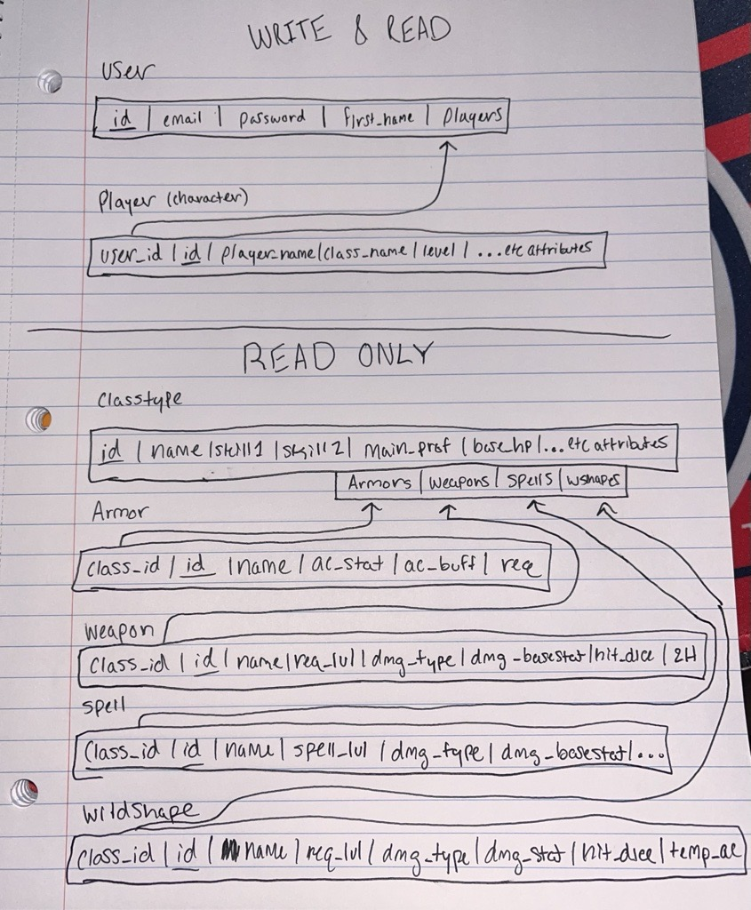

<!-- Project Intro -->
 

  <h3 align="center">D&D Character Creator</h3>
  <h4 align="center">Hunter Stout</h3>

## Pip Reqs

* Flask==3.0.0
* Flask_Login==0.6.3
* flask_sqlalchemy==3.1.1
* SQLAlchemy==2.0.23

## Built With

* Python
* Flask
* MVC Framework
* Bootstrap v5.1.0
* JQuery v3.5.1
* SQLite3
* SQLiteStudio

## ER-Diagram

 

## Query Types

* Querry used to grab all Players belonging to the current user, in desc. player.id order... Basically is to sort by newest player.
  * SELECT * AS (Attribute Names) 
  * FROM Player JOIN User ON User.id = Player.user_id
  * WHERE User.id = current_user.id (UserMixin) ORDER BY player.id DESC

* Querry used to see if class attribute exists based on user's input for name & classtype id.
  * SELECT Classtype.name FROM Classtype WHERE Classtype.class_id = (User Input) AND Classtype.name = (User Input)

* Querry used on a few pages for finding the class a player chooses.
  * SELECT * FROM Classtype WHERE id = (User input)
